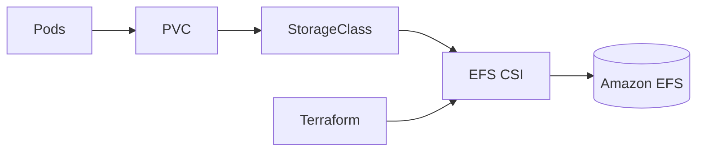

# Presentación — EFS CSI Driver para EKS

Material listo para publicar en **LinkedIn** (post + carrusel). Copiá cada sección como una diapositiva o bloque del post.

**Speech listo para copiar/pegar:** [speech-linkedin.md](speech-linkedin.md)

---

## Slide 1 — Hook

### PVC compartidos en EKS sin pelearte con el CSI a mano

Presento **EFS CSI Driver para EKS**: Almacenamiento compartido en EKS: EFS + CSI driver + StorageClass — Terraform

Terraform · EKS · EFS · CSI Driver · IRSA

---

## Slide 2 — El dolor

- Apps que necesitan RWX
- Driver e IRSA mal configurados
- Cada ambiente se arma distinto

**Automatizar esto no es lujo — es repetibilidad.**

---

## Slide 3 — Qué hace

---

## Slide 4 — Características

- **EFS CSI**: Driver en el cluster EKS
- **IRSA**: Permisos IAM vía OIDC
- **PVC**: Base para StorageClass RWX
- **IaC**: Repetible entre ambientes

---

## Slide 5 — Cómo probarlo

1. Cloná el repo
2. Copiá `terraform.tfvars.example` → `terraform.tfvars`
3. `terraform init && plan && apply`
4. Revisá outputs / recursos en la consola AWS

Repo: `https://github.com/ghcetraro/terraform_aws_eks_efs`

---

## Slide 6 — CTA

Open source · MIT · listo para adaptar a tu cuenta.

⭐ Si te sirve, estrella en GitHub y compartí feedback.

`https://github.com/ghcetraro/terraform_aws_eks_efs`
